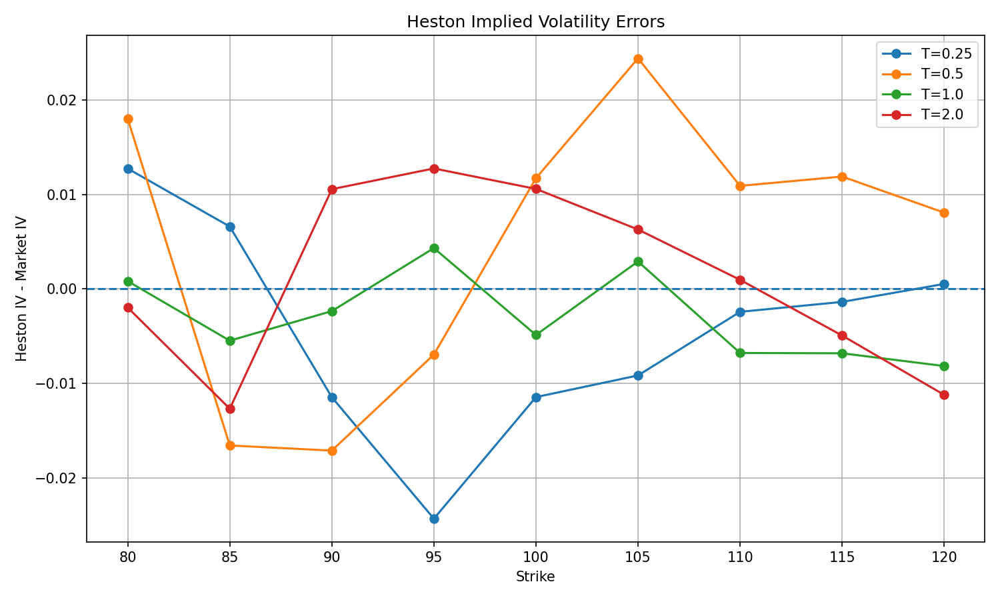
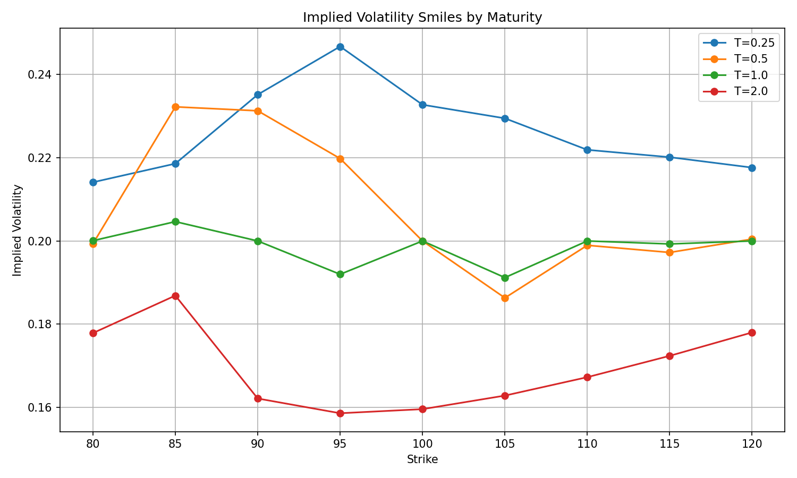

# Heston Implied Volatility Surface Calibration

This project implements a full quantitative pipeline to construct an implied volatility surface from market data and calibrate the Heston stochastic volatility model using Fourier-based pricing.

## Overview

The workflow follows a standard quantitative finance pipeline:

1. Load market option data (CSV)
2. Compute implied volatilities using Black-Scholes
3. Build the implied volatility surface
4. Price options under the Heston model (Fourier method)
5. Convert Heston prices to implied volatilities
6. Calibrate Heston parameters to market data
7. Analyze errors and visualize results

---

## Mathematical Framework

### Black-Scholes

The Black-Scholes model assumes constant volatility:

\[
dS_t = (r - q) S_t dt + \sigma S_t dW_t
\]

Option pricing:

\[
C = S_0 e^{-qT} N(d_1) - K e^{-rT} N(d_2)
\]

Implied volatility is obtained by solving:

\[
C_{BS}(\sigma) = C_{market}
\]

---

### Heston Model

The Heston model introduces stochastic volatility:

\[
dS_t = (r - q) S_t dt + \sqrt{v_t} S_t dW_t^S \\
dv_t = \kappa (\theta - v_t) dt + \sigma \sqrt{v_t} dW_t^v
\]

\[
dW_t^S dW_t^v = \rho dt
\]

Option pricing is performed via Fourier inversion:

\[
C = S_0 e^{-qT} P_1 - K e^{-rT} P_2
\]

---

## Implementation Details

- **Language**: C++ (core engine), Python (visualization)
- **Numerical methods**:
  - Newton-Raphson + bisection (implied volatility)
  - Simpson integration (Heston pricing)
  - Local search calibration
- **Architecture**:
  - `models/`: Black-Scholes, Heston parameters
  - `pricers/`: Heston Fourier pricer
  - `calibration/`: implied vol solver & calibrator
  - `market/`: data handling
  - `analytics/`: surface construction & analysis

---

## Results

### Black-Scholes Validation

- Call Price: 9.4134  
- Delta: 0.5987  
- Gamma: 0.01933  
- Vega: 38.6668  
- Implied Volatility: 0.20  

---

### Calibration Performance

| Metric | Value |
|------|------|
| Initial RMSE | 0.0291 |
| Final RMSE | **0.0107** |

→ Error reduced by ~65%

---

### Calibrated Parameters

| Parameter | Value |
|----------|------|
| \( v_0 \) | 0.05375 |
| \( \kappa \) | 0.84375 |
| \( \theta \) | 0.00625 |
| \( \sigma \) | 0.08125 |
| \( \rho \) | -0.234375 |

---

## Visualization

### Calibration Errors


### Volatility Smiles


---

## Critical Analysis

### Strengths

- Full end-to-end quant pipeline
- Non-trivial Heston implementation (Fourier-based)
- Consistent calibration workflow
- Significant error reduction

### Limitations

- Local optimization (risk of local minima)
- No liquidity weighting
- Numerical sensitivity (Fourier integration)
- Parameter instability (very low \( \theta \))

The structured errors suggest that the model does not fully capture the market dynamics, especially for longer maturities.

---

## Full Report

A detailed theoretical and implementation report is available here:

👉 [Read the full report (PDF)](./report/rapport_projet_heston.pdf)

---

## How to Run

```bash
mkdir build && cd build
cmake ..
make

./run_market_analysis
./run_heston_surface_analysis
./run_heston_calibration
